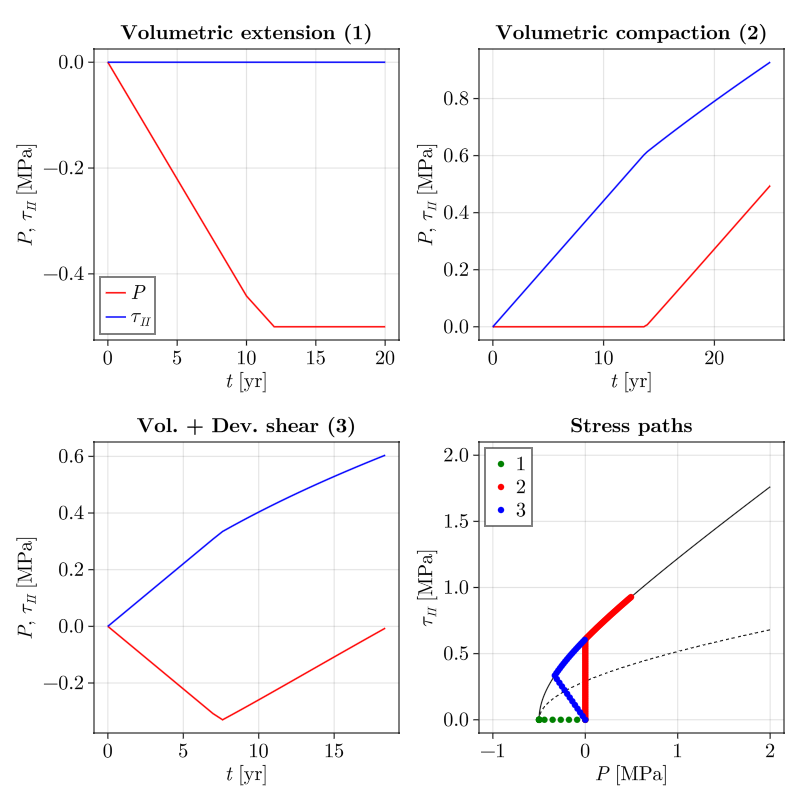
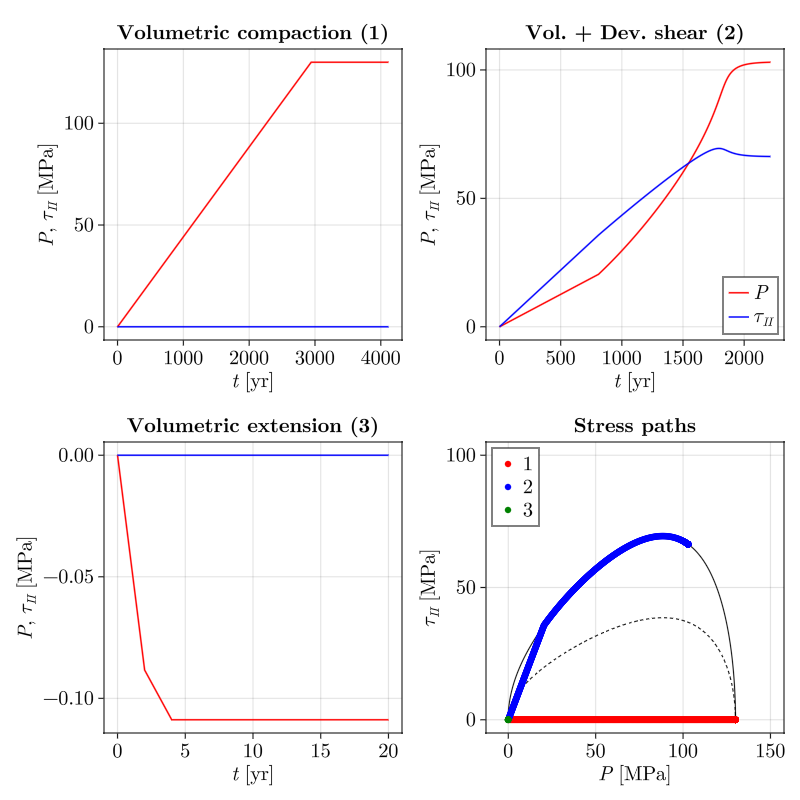

# RheologyCalculator.jl

# Plasticity models

## VEP + Cap (Popov et a., 2025)

## Hyperbolic (Abbo & Sloan, 1995)

## Modified Cam-Clay - classical (e.g., de Souza Neto book)

## Modified Cam-Clay - Golchin (Golchin et al., 2021)

