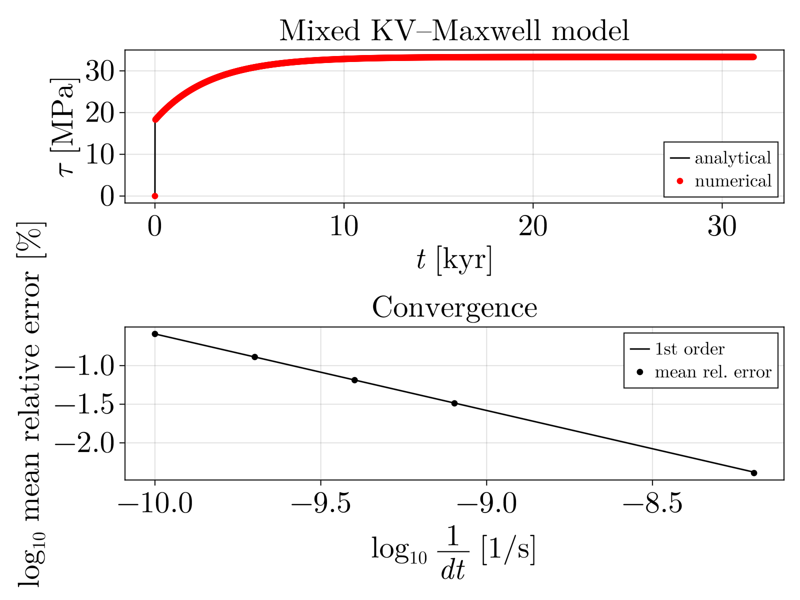
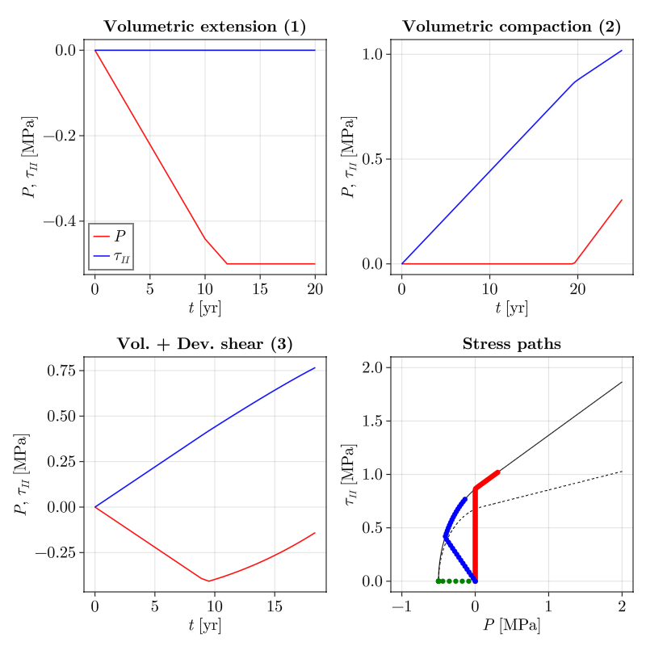
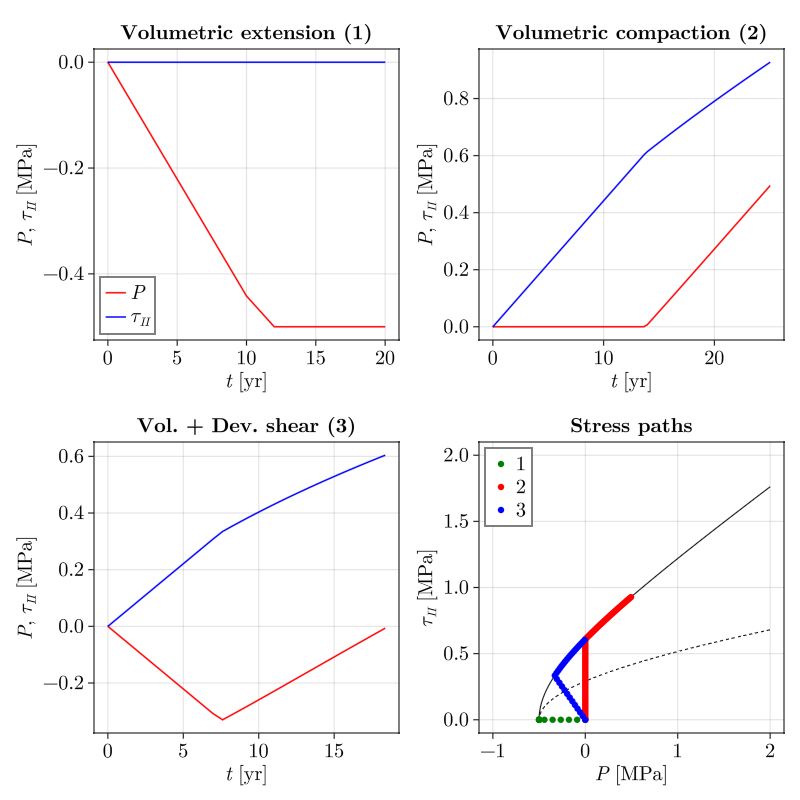
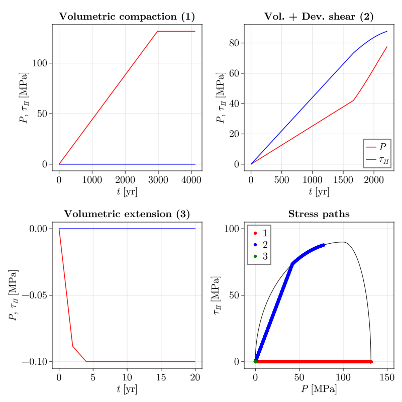
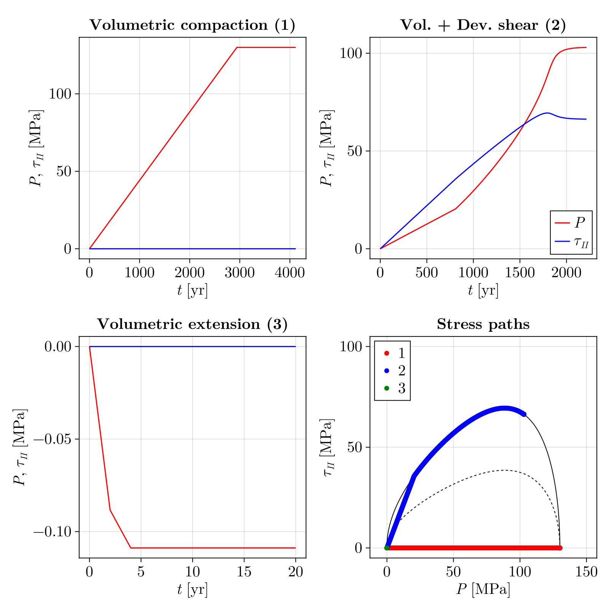
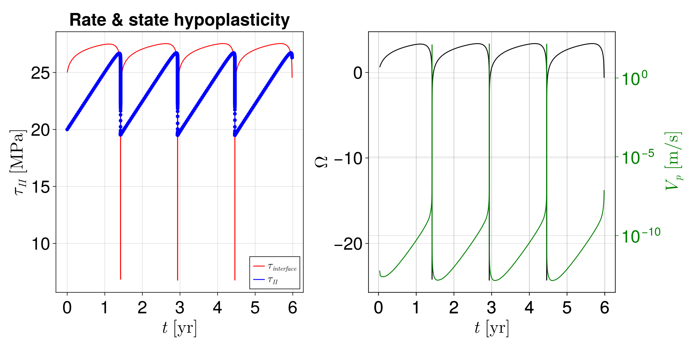

# RheologyCalculator.jl

[](https://github.com/albert-de-montserrat/RheologyCalculator.jl/actions/workflows/ci.yml)

`RheologyCalculator.jl` builds and solves local rheological models from small
viscous, elastic, and plastic building blocks. Elements can be composed in
series, in parallel, or in nested hybrid networks, then converted into a
nonlinear residual system solved with Newton iterations.

The package core is independent of any particular material catalogue. The
example rheologies in [`rheologies/`](./rheologies) define common viscous,
elastic, plastic, and pressure-dependent laws by extending the state-function
interface.

## Quick Start

```julia
using RheologyCalculator

include("rheologies/RheologyDefinitions.jl")

viscous = LinearViscosity(1e22)
elastic = IncompressibleElasticity(1e10)
c = SeriesModel(viscous, elastic)

vars   = (; ε = 1.0e-14, θ = 0.0)
args   = (; τ = 1.0e3, P = 0.0)
others = (; dt = 1.0e10, τ0 = (0.0,), P0 = (0.0,))

x = initial_guess_x(c, vars, args, others)
x = solve(c, x, vars, others)
```

## Composite Models

Models are assembled with `SeriesModel` and `ParallelModel`:

```julia
maxwell = SeriesModel(LinearViscosity(1e22), IncompressibleElasticity(1e10))
kv      = ParallelModel(LinearViscosity(1e21), IncompressibleElasticity(1e10))
burgers = SeriesModel(LinearViscosity(1e22), kv)
```

Nested generalized Maxwell / Kelvin-Voigt branches are supported, including
elastic elements inside parallel branches:

```julia
c = SeriesModel(
    LinearViscosity(1e22),
    ParallelModel(
        LinearViscosity(1e21),
        SeriesModel(LinearViscosity(1e21), IncompressibleElasticity(1e10)),
    ),
)
```



See [`examples/Maxwell_KV_Maxwell.jl`](./examples/Maxwell_KV_Maxwell.jl) for a
comparison against the analytical solution, and
[`docs/src/strain_rate_correction.md`](./docs/src/strain_rate_correction.md) for
the elastic correction derivation.

## Plasticity Models

### VEP + Cap (Popov et al., 2025)



### Hyperbolic (Abbo & Sloan, 1995)



### Modified Cam-Clay - classical (e.g., de Souza Neto book)



### Modified Cam-Clay - Golchin (Golchin et al., 2021)



### Rate and State friction (Herrendörfer et al., 2018)


