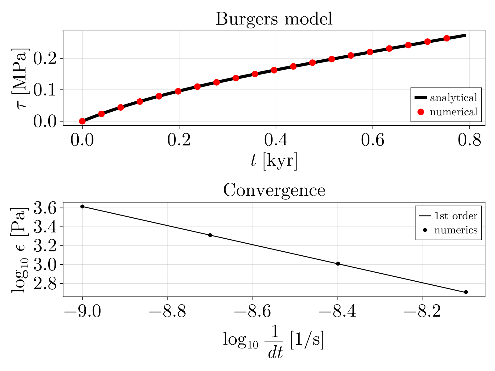

# Stress-time curve of a Burger's material

We start by defining the material properties 
```julia
η1, η2, η3 = 5e19, 1e20, 1e21
damper1    = LinearViscosity(η1)
damper2    = LinearViscosity(η2)
damper3    = LinearViscosity(η3)
G, K1, K2  = 10e9, 46.67e9, 30e9
spring1    = Elasticity(G, K1)
spring2    = Elasticity(G, K2)
```

and rheology model

```julia-repl
julia> p = ParallelModel(damper2, spring1)
|--▪̲̅▫̲̅▫̲̅▫̲̅¹--|
|--/\/\/¹--|

julia> c = SeriesModel(damper3, spring2, p)
--▪̲̅▫̲̅▫̲̅▫̲̅¹----/\/\/¹--|--▪̲̅▫̲̅▫̲̅▫̲̅²--|
                    |--/\/\/²--|
```

Next, we define the input variables, which are the strain rate `ε` and the volumetric strain rate `θ`
```julia
vars = (; ε = 1.0e-15, θ = 1.0e-20)  # input variables (constant)
```
and the initial guess of the variables we want to solve for:
```julia
args = (; τ = 1.0e3, P = 1.0e6) 
```
and we build the solution vector `x` that contains the initial guess for the variables we want to solve for:
```julia
x   = initial_guess_x(c, vars, args, others)
```

Now we are ready to compute the time evolution of the stress tensor, with some aid from a helper function
```julia
function stress_time(c, vars, x; ntime = 200, dt = 1.0e8)
    ntime = 200
    dt    = 1.0e9
    τ     = zeros(ntime)
    t_v   = zeros(ntime)
    τ_e   = (0.0, 0.0)
    P_e   = (0.0, 0.0)
    t     = 0.0
    for i in 2:ntime
        # non-differentiable variables needed to evaluate the state functions
        others = (; dt = dt, τ0 = τ_e, P0 = P_e) 
        # solve the system of equations
        x      = solve(c, x, vars, others)
        # Post-process the results
        τ_e    = compute_stress_elastic(c, x, others)   # elastic stress
        P_e    = compute_pressure_elastic(c, x, others) # elastic pressure
        # Store the results
        τ[i]   = τ_e[1]
        t     += others.dt
        t_v[i] = t
    end
    return t_v, τ
end

t_v, τ = stress_time(c, vars, x; ntime = 25, dt = 1.0e9);
```

We can finally compute the analytical solution of the stress time-evolution, and compare it against our results

```julia
using GLMakie

function simulate_series_Burgers_model(E1, η1, E2, η2, ε̇, t_max, dt)
    N    = Int(div(t_max, dt)) + 1
    t    = range(0, step = dt, length = N)
    σ    = zeros(N) # Stress
    ε_KV = zeros(N) # Strain in Kelvin–Voigt element
    σ_KV = zeros(N)
    for i in 2:N
        # Previous values
        ε_KV_prev = ε_KV[i - 1]
        σ_prev    = σ[i - 1]
        dεKVdt    = (σ_prev - E2 * ε_KV_prev) / η2  # Kelvin–Voigt strain rate
        ε_KV[i]   = ε_KV_prev + dt * dεKVdt         # Update ε_KV
        dσdt      = E1 * (ε̇ - σ_prev / η1 - dεKVdt) # Stress rate from Maxwell element
        σ[i]      = σ_prev + dt * dσdt              # Update stress
        σ_KV[i]   = E2 * ε_KV[i] + η2 * dεKVdt      # Calculate σ_KV explicitly at this step
    end
    return t, σ
end

η1 = 2 * c.leafs[1].η
η2 = 2 * c.branches[1].leafs[1].η
G1 = 2 * c.leafs[2].G
G2 = 2 * c.branches[1].leafs[2].G

t_anal, τ_anal = simulate_series_Burgers_model(G1, η1, G2, η2, vars.ε, t_v[end], (t_v[2] - t_v[1]) / 10);

# make figure
SecYear = 3600 * 24 * 365.25
fig     = Figure(fontsize = 30, size = (800, 600))
ax      = Axis(fig[1, 1], title = "Burgers model", xlabel = "t [kyr]", ylabel = L"\tau [MPa]")

lines!(ax, t_anal / SecYear / 1.0e3, τ_anal / 1.0e6, label = "analytical", linewidth = 5, color = :black)
scatter!(ax, t_v / SecYear / 1.0e3, τ / 1.0e6, label = "numerical", color = :red, markersize = 15)

axislegend(ax, position = :rb)
ax.xlabel = L"t [kyr]"
ax.ylabel = L"\tau [MPa]"
display(fig)
```

